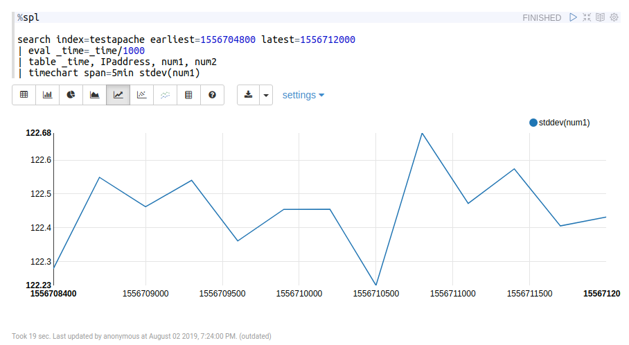
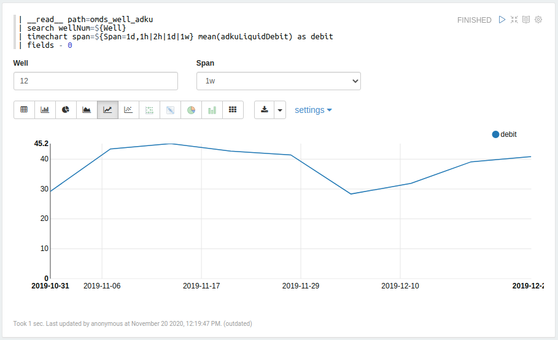

# Simple Zeppelin Scala

 

This is an OTL interpreter for Apache Zeppelin. This interpreter works in tandem with OT Simple Rest and Apache Spark backend. REST Server collects OTL queries and converts them into Spark SQL queries with full support of all features of [SuperDispatcher](https://github.com/ISGNeuro/dispatcher).

## Installation

0. Let the `$ZEPPELIN_HOME` is the installation path of Apache Zeppelin.
1. Create subfolder `otl` in `$ZEPPELIN_HOME/interpreter`:
```
cd $ZEPPELIN_HOME/interpreter
mkdir otl
```
2. Copy `interpreter-setting.json` from this project to `$ZEPPELIN_HOME/interpreter/otl`. Copy `zeppelin-site.xml` to `$ZEPPELIN_HOME/conf`. If files are already existed, be careful about overwriting your local settings.
```
cp interpreter-setting.json $ZEPPELIN_HOME/interpreter/spl
cp zeppelin-site.xml $ZEPPELIN_HOME/conf
```
3. Make assembly of the current project. It's strongly recommended to make assembly rather than package due to external dependencies. Then copy jar-file of assembly to `$ZEPPELIN_HOME/interpreter/otl` and restart zeppelin daemon.

4. After restart, open Zeppelin and add a new interpreter with name "otl".

## Configuration

1. You should specify correct path to OT Simple Rest in the following interpreter properties in Zeppelin:

- `OTP.rest.host` (ex.: 192.168.4.65)
- `OTP.rest.port` (ex.: 50000)
- `OTP.rest.auth.username` (ex.: admin)
- `OTP.rest.auth.password` (ex.: 12345678)
- `OTP.rest.cache.host` (ex.: 192.168.4.65, usually the same as `OTP.rest.host`)
- `OTP.rest.cache.port` (ex.: 80, usually 80)

2. Optional properties:

- `OTP.query.timeout`. Timeout (seconds) for waiting for the result. Default value is 60.
- `OTP.query.ttl`. "Time-to-live" of cache of your query in dispatcher base. Usually need when multiple users produce the same query simultaneously. Default value is 60.
- `OTP.query.convert_time` ("true" or "false"). If converting from seconds to milliseconds required for '_time' column. Older Apache Zeppelin versions require timestamp in milliseconds for the correct visualization. Default value: "true"

## Usage

#### Writing queries

Just open Zeppelin notebook and write OTL queries.

Query:
```
%otl
| makeresults count=5 | streamstats count as cnt | eval squared = cnt * cnt
```
Result:
```
+----------+---+-------+
|     _time|cnt|squared|
+----------+---+-------+
|1605871742|  1|      1|
|1605871742|  2|      4|
|1605871742|  3|      9|
|1605871742|  4|     16|
|1605871742|  5|     25|
+----------+---+-------+
```

#### Time range

You can specify time range as `earliest` and `latest` params in the first command of query. Interpreter supports unix-time and "YYYY-MM-DD:HH:mm:ss" formats in `earliest` and `latest`. Time range will be extracted and passed as 'tws' and 'twf' properties of request to REST.



Time range affects only on data from indexes, not from external storage.

#### Put results to resource pool

You can put the resulting dataset into resource pool and then get it within another cell.

1. Put dataset to resource pool with id "debit".

Query:
```
%otl
| __read__ path=omds_well_adku
| search wellNum=13
| timechart span=1d mean(adkuLiquidDebit) as liquid, mean(adkuOilDebit) as oil
| fields - 0
| zput id=debit
```
Result:
```
+----------+------+-----+
|     _time|liquid|  oil|
+----------+------+-----+
|1572566400| 108.5| 92.0|
|1572739200| 108.0| 92.0|
|1573084800| 117.0|100.0|
| ........ | .... | ... |
|1574121600| 101.0| 85.5|
+----------+------+-----+
```

2. Get dataset from resource pool and calculate a correlation using spark functions:

Scala cell:
```scala
%spark
import org.apache.spark.sql.functions._
val cacheDS = z.get("debit").toString
val df = spark.read.json(Seq(cacheDS).toDS)
df.agg(corr("liquid", "oil").alias("correlation")).show
```
Result:
```
+------------------+
|       correlation|
+------------------+
|0.9260465713746013|
+------------------+
```

#### Form templates

You can use Zeppelin templates in OTL query to create form inputs.

Query:
```
| __read__ path=omds_well_adku
| search wellNum=${Well}
| timechart span=${Span=1d,1h|2h|1d|1w} mean(adkuLiquidDebit) as debit
| fields - 0
```



#### Tokens in query

You can use variables previously saved in resource pool within OTL query.

1. Put object to resource pool:

Scala cell:
```scala
%spark
z.put("rename", "newname")
```

2. Use object value as token in OTL query.

Query:
```
| __read__ path=omds_well_adku
| search wellNum=13 AND adkuLiquidDebit=*
| timechart span=1d mean(adkuLiquidDebit) as $rename$
| fields - 0
```
Result:
```
+----------+-------+
|     _time|newname|
+----------+-------+
|1572566400|  108.5|
|1572739200|  108.0|
|1573084800|  117.0|
|1573171200|  110.0|
| ........ | ..... |
|1574380800|  113.5|
|1574467200|  106.0|
|1574553600|   96.0|
+----------+-------+
```

## Tested environment
- Apache Zeppelin 0.8.2
- Apache Spark 2.4.3
- OT Simple REST 1.6.0
- OT Super Dispatcher 1.2.0
- OT Scalarest 0.1.0

## Authors

- Nikolay Ryabykh (nryabykh@isgneuro.com)
- Sergey Ermilov (sermilov@isgneuro.com)